# How to Backup Your Text Files in Github
## Scenario: You have a bunch on notes saved locally as text files.
### Let's back those up in the cloud before your workstation dies.

1. Create a github account: 
    https://github.com/signup?source=login

2. Create a new repository to store your files:
    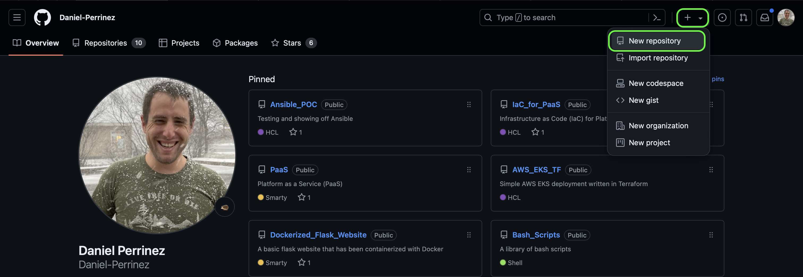

    Use these settings:
    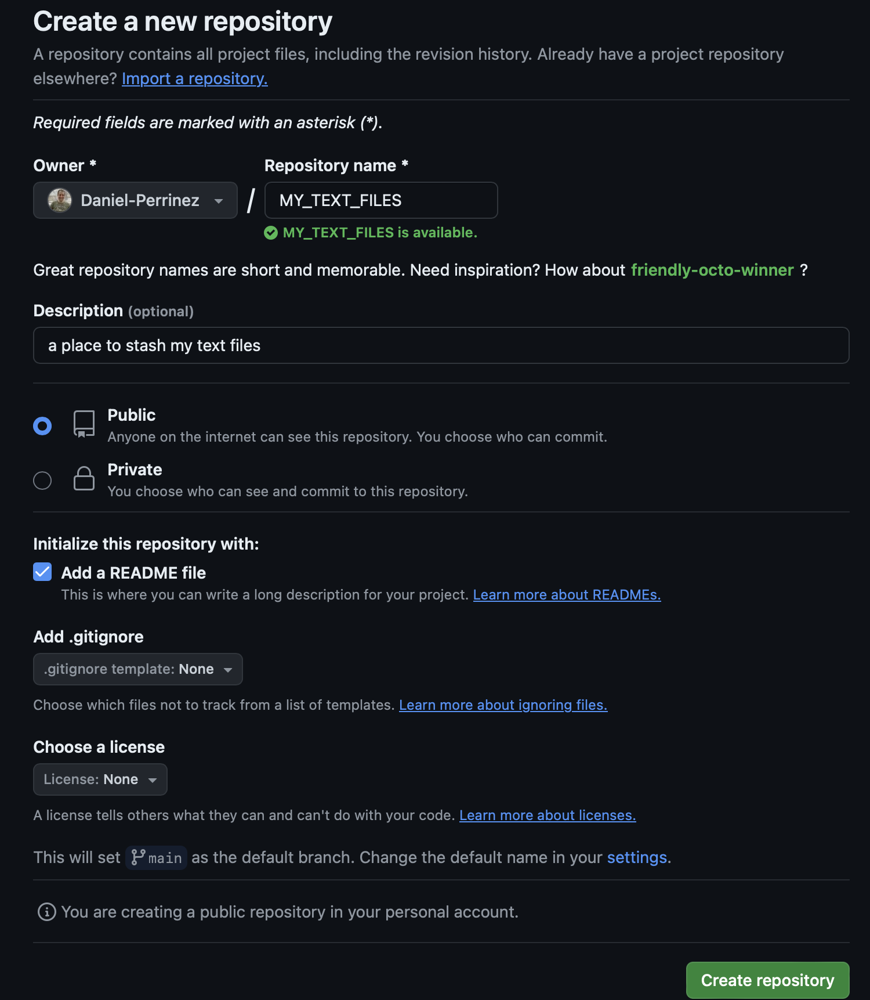

3. Copy your repo url:
    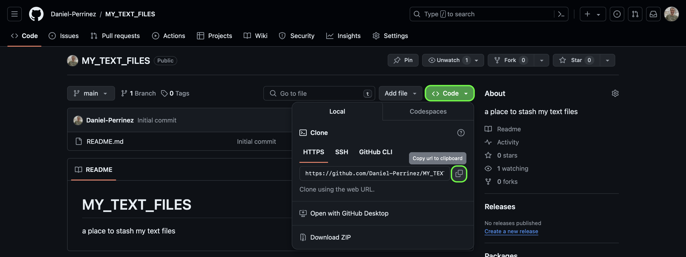

4. Open command prompt / terminal session on your workstation and
    change directory (cd) to your Desktop and clone your new repo.
    Then cd into your repo directory
    ```
    cd ~/Desktop
    git clone https://github.com/Daniel-Perrinez/MY_TEXT_FILES.git
    cd MY_TEXT_FILES/
    ```

5. Add your files to this directory.

    Once you've moved all of your files to the repository directory you should view your repo status.
    ```
    git status
    ```
    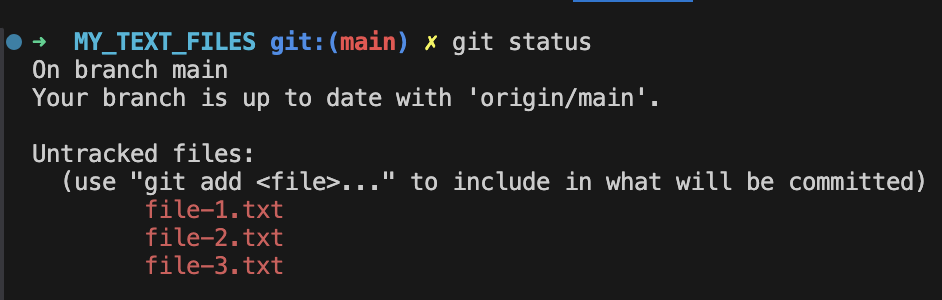

    Now 'add' your files to staging and commit them to your repository
    ```
    git add .
    git status
    ```
    

    Now commit these files to your repository.
    ```
    git commit -a -m "backing up my text files to github"
    ```
    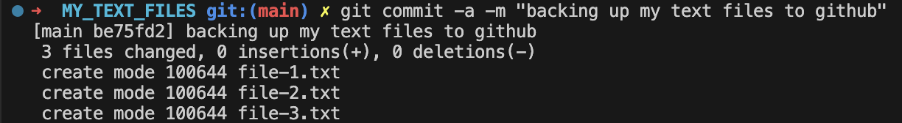
    
    Great, now your files have been added to source control, but they're still not backup in the cloud yet.

6. Finally push your files to github
    ```
    git push origin main
    ```
    You'll be prompted for your github credentials.
    Check your status and notice what's changed.
    ```
    git status
    ```

    Now go back to your browser and refresh your repo page if needed.
    [Check your repo](https://github.com/Daniel-Perrinez/MY_TEXT_FILES)
    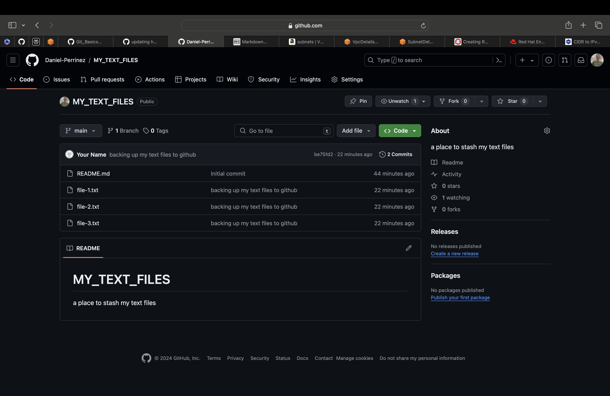
    Congratulations you've now backed up your text files in github!

--- 
# TL;DR

This is the workflow moving forward:

1. Create a branch when making changes.
```
git checkout main
git pull origin main
git checkout -b branch_abc123
```

Make some changes to files.
```
git add .
git commit -a -m "Add update to my files"
```
Commit frequently

2. When ready open a code review ("pull request").
```
git push origin branch_abc123
```
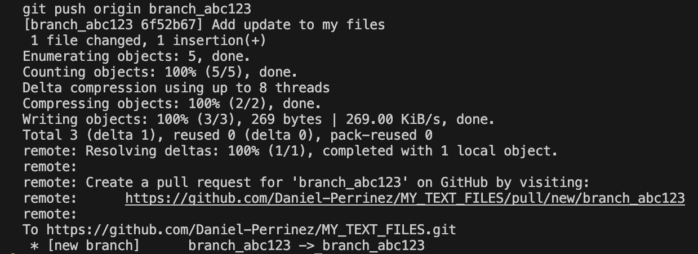

Click, 'Create pull request'
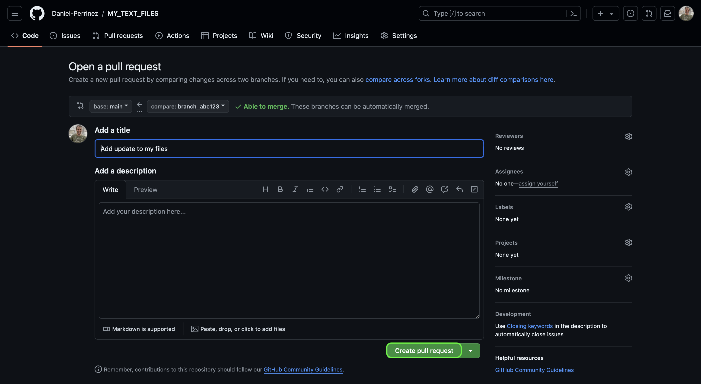

Click, 'Merge pull request'
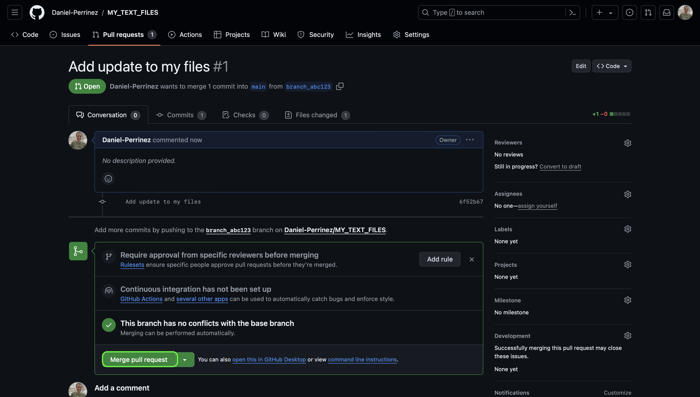

Click, 'Confirm merge'
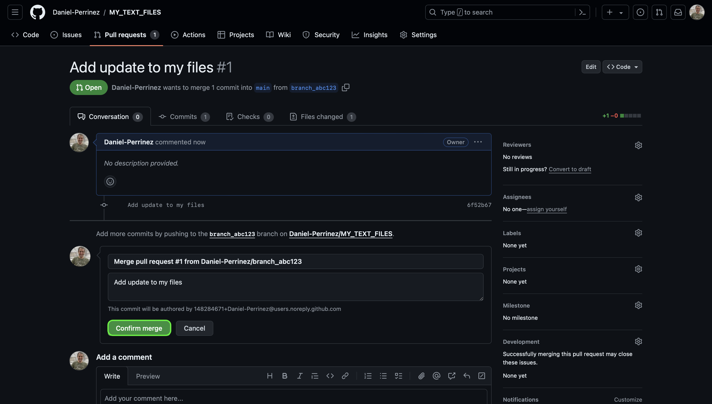

Click, 'Delete branch' to clean up.
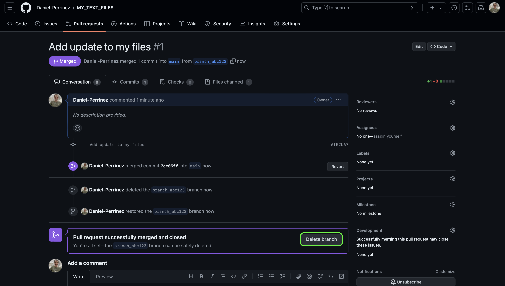


[Markdown cheat sheet](https://www.markdownguide.org/cheat-sheet/)